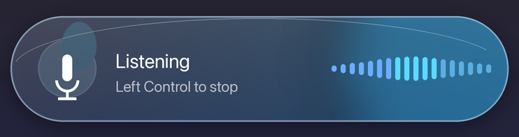
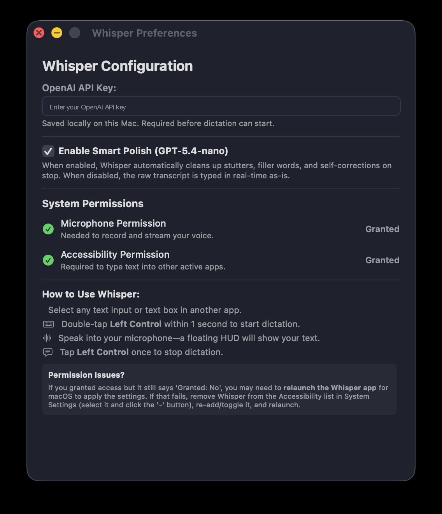
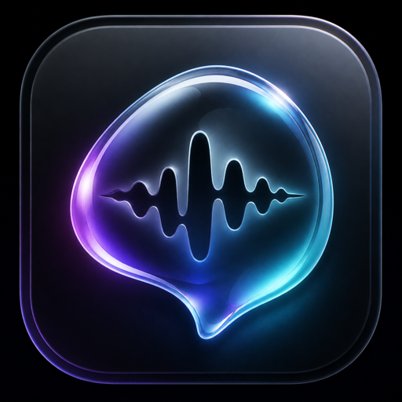
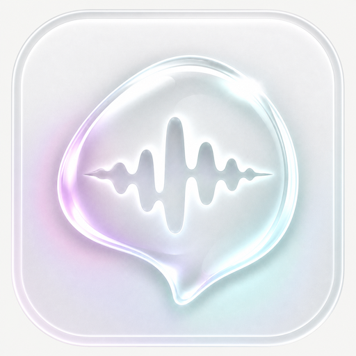

# Whisper

Whisper is a lightweight macOS menu bar dictation app that streams microphone audio to OpenAI's realtime transcription API, types the transcript into the active text field, and optionally polishes the result when you stop.





## App Icons

| Dark | Light |
| --- | --- |
|  |  |

## Features

- Double-tap **Left Control** within 1 second to start dictation.
- Tap **Left Control** once to stop.
- Streams transcription into the currently focused app.
- Optional Smart Polish cleans up filler words, stutters, punctuation, and self-corrections after stopping.
- Floating liquid-glass HUD with live audio-level feedback.
- Universal Control focus guard so the hotkey only triggers on the Mac that currently has keyboard/mouse focus.
- Preferences window for OpenAI API key, microphone permission, and accessibility permission.

## Requirements

- macOS 14 or newer.
- Swift 6.3 or newer to build from source.
- An OpenAI API key with access to the realtime transcription API.
- Microphone permission.
- Accessibility permission so Whisper can type into other apps.

Whisper does **not** include an OpenAI API key. Each user must enter their own key in Preferences.

## Build From Source

```bash
swift test
./build.sh
open Whisper.app
```

To install the built app locally:

```bash
cp -R Whisper.app /Applications/Whisper.app
open /Applications/Whisper.app
```

## Running the Release Build

The release app is ad-hoc signed because this project is not built with an Apple Developer account. On another Mac, Gatekeeper may block the downloaded app.

Try right-clicking the app and choosing **Open** first. If macOS still blocks it after download, you can remove the quarantine attribute:

```bash
xattr -dr com.apple.quarantine /Applications/Whisper.app
open /Applications/Whisper.app
```

If you prefer not to run an unsigned downloaded binary, build it locally from source using `./build.sh`.

## Usage

1. Launch Whisper.
2. Open Preferences from the menu bar item.
3. Enter your OpenAI API key.
4. Grant microphone and accessibility permissions.
5. Select a text field in any app.
6. Double-tap **Left Control** to start dictation.
7. Tap **Left Control** once to stop.

## Version

1.0 initial release.
